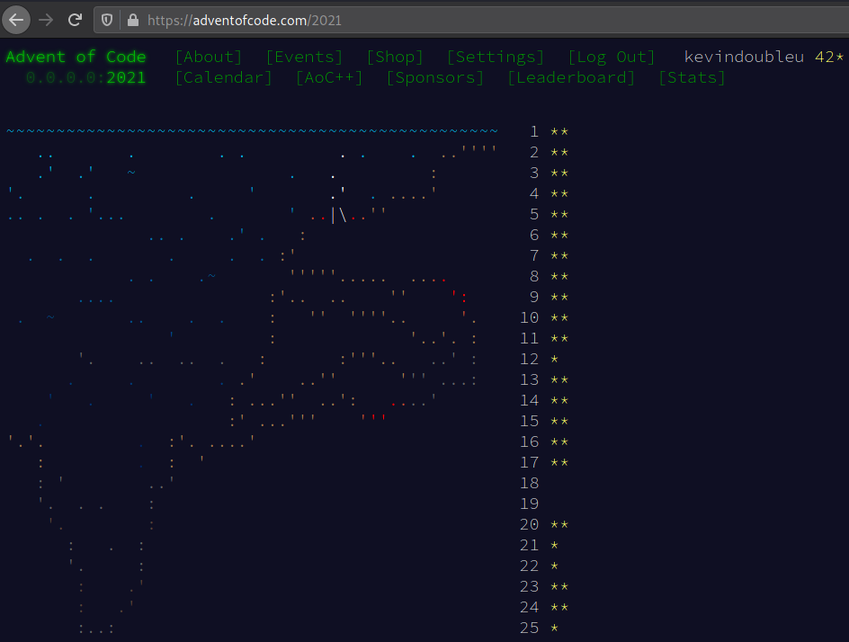

# advent-of-code-2021

as of 25 december 2021, i got a total of 42 out of 49 stars

the puzzles were amazingly crafted, though the harder ones are frustrating at first, eventually as i put more focus into the problems, insights start to appear and the solutions become clearer.

this was a great exercise for me, i've practiced:

- breaking down big problems into smaller problems
- modularizing code
- improving code readability
- optimization (by completely revamping the data structures used)
- approaching problems with different perspectives
- managing workflow
- probably a lot more things i couldn't remember, etc.

it was fun, i'll aim for 49 stars next year
